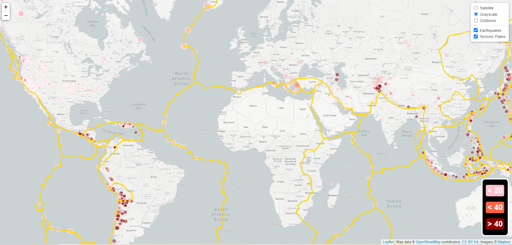

# Leaflet Homework - Visualizing Data with Leaflet

Welcome to the United States Geological Survey, or USGS for short! The USGS is responsible for providing scientific data about natural hazards, the health of our ecosystems and environment; and the impacts of climate and land-use change. Their scientists develop new methods and tools to supply timely, relevant, and useful information about the Earth and its processes. As a new hire, you will be helping them out with an exciting new project!

The USGS is interested in building a new set of tools that will allow them visualize their earthquake data. They collect a massive amount of data from all over the world each day, but they lack a meaningful way of displaying it. Their hope is that being able to visualize their data will allow them to better educate the public and other government organizations (and hopefully secure more funding..) on issues facing our planet.

Using the monthly dataset from the USGS website, I created a map (as seen above) using Leaflet light map that plots all of the earthquakes based on their longitude and latitude. 

   

Data markers reflect the magnitude of the earthquakes by their size and depth(km) by color. Earthquakes with higher magnitudes appear in larger circles, and earthquakes with greater depth appear darker in color. This is made clear by the legend in the bottom right corner.

Popups provide additional information about the earthquake upon click.

In the second step of this project, I made a satellite, outdoor, and another grayscale map. These maps (as seen below) illustrates the relationship between tectonic plates and seismic activity. 

A second data set was pulled in from <https://github.com/fraxen/tectonicplates>.

These maps contain a number of base maps to choose from as well as different data sets in overlays that can be turned on and off independently. In addition, layer controls were added to the map.

